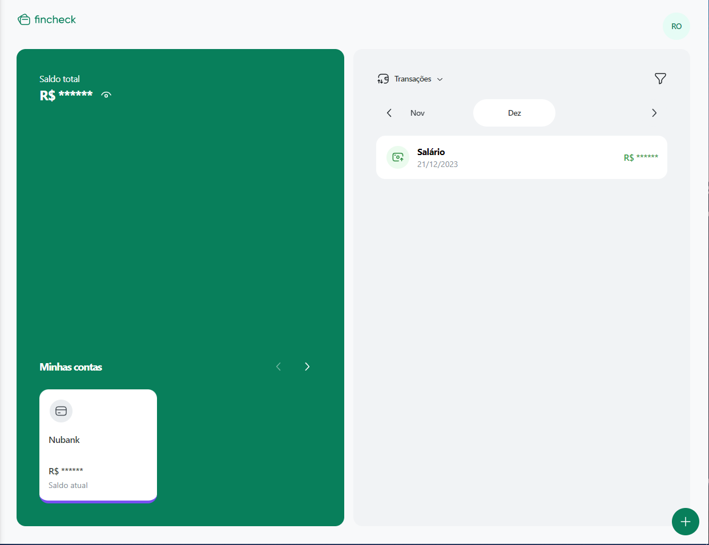

<h3 align=center>Working with:</h3>

  &nbsp
  &nbsp
  &nbsp
  &nbsp
  &nbsp
  &nbsp

Projeto financeiro, sendo possível adicionar contas bancárias, cadastrar despesas e receitas e utilizar filtros para buscas

<h3 align="center">WEB</h3>

